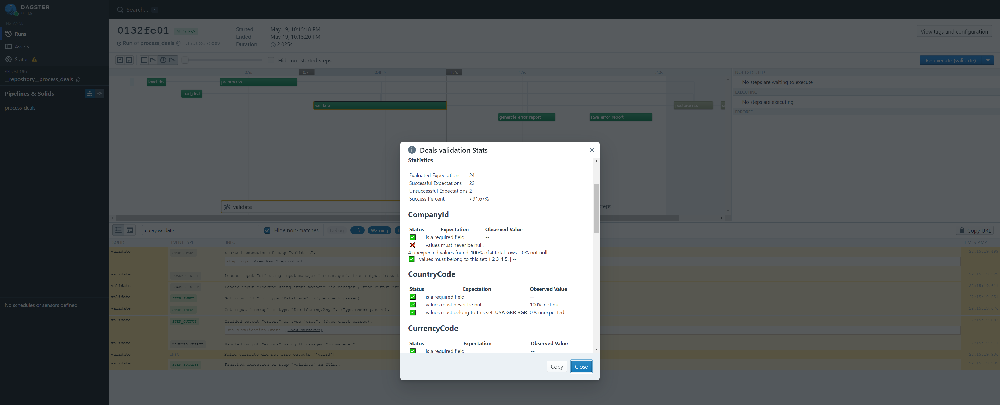

# Dealpipe - a simple data pipeline experiment

## Requirements

Create a python program to read two flat files (excel and csv), validate them and to produce output files.

### Output File

The output should be the following files:
* Original file with extra columns including RowNo (A unique row identifier), AsOfDate (date/time of the processing), ProcessIdentifier (a unique process identifier), and RowHash (a calculated hash for each row). All extra fields should be placed at the end of the file except the RowNo which should be the starting field in each row.
* Parquet File (Parquet version of the above file)
* Error file (if there is any error involved in processing)

### Input File

Produce a series of input files that will test the logic in your python package. For example, a file containing character codes within a decimal field will produce an error file. The error file is to contain the reason for failure and the field and row on which it occurred.

1. CSV file - The input file should be a Deal list having 10 fields each with the following types:

    * 1 String field - for the Deal Name and it is mandatory
    * 5 Decimal fields (28,8) – any value is allowed (negative and positive) and you can name them D1 to D5
    * 1 Boolean field - indication Is Active flag with values Yes or No
    * 1 Country field (ISO standard) – create a lookup file with Code, Name
    * 1 Currency field (ISO standard) – create a lookup file with Code, Name
    * 1 Company field (Create a list of dummy companies with Id and Name ).
    * Make the company, currency, country, and one decimal field mandatory.

2. For Excel - Create two worksheets:
    * One containing the 10 fields specified above
    * The other containing the list of lookup codes (company, currency, and country)

The process should do the following validations:

* Validate data types
* Validate Country against a list
* Validate currency against a list
* Validate the company against the company lookup and include the company name in the output record too.

Expectation:

* The test can be done in a couple of hours, but we would like to see your quality of thinking, the best practices, and clean code so don't rush it
* The pipeline should have a fair set of unit tests representing different scenarios
* Give us a list of improvements and suggestions that can be done to make the code better.

## Implementation

Use the `dagster` python tool to implement a well-tested data pipeline that implements all requirements.
Dagster provides a very nice pipeline development and debugging interface called `dagit` which makes it easy to interactively see what the pipeline does at each step.

# Development setup

In order to start developing you need to have the Python (3.9.x) interpreter installed on your system, you can use the [pyenv project](https://github.com/pyenv/pyenv) to manage multiple versions of python.
Then you need to install the [poetry dependency management tool](https://python-poetry.org/).
After you have the prerequisites installed you need to initialize your virtual environment by changing to the project's directory (brady) and executing the following command:
```
poetry install
```

That's it. Every time you want to work within your virtual environment you just need to activate it by executing the command:
```
poetry shell
```

For more instructuons on poetry, please see the guide on [https://python-poetry.org/](https://python-poetry.org/)

### Running the examples in dagit UI

Once you've set up your virtual environment and activated it you can run and debug the pipeline
There are configuration presets which you can use to run the pipeline - they are placed in the 'presets' directory. 
You can easily run the pipeline with all configuration presets in `dagit` by starting it like so:
```
dagit -f dealpipe/process_deals.py -h 0.0.0.0 -p 3000
```

Click [this link to see the Pipeline DAG Definition](http://localhost:3000/workspace/__repository__process_deals@process_deals.py/pipelines/process_deals/)

When you are ready to run the pipeline navigate to the playground by opening the following link:
[Dagit pipeline playground](http://localhost:3000/workspace/__repository__process_deals@process_deals.py/pipelines/process_deals/playground)
Now just pick the desired preset from the `Preset` dropdown and then hit the `Launch Execution` button (bottom right).

After you click the `Launch Execution` button the pipeline is started and you can see the execution chart and log in real time.
The pipeline defines custom events that could be used to view interactive state reports in the form of markdown for each step.

If there are any errors, the following Excel report, with row-wise errors, is generated:


Here are some screenshots:




### TODO

* Unit Tests (mostly of the solids)
